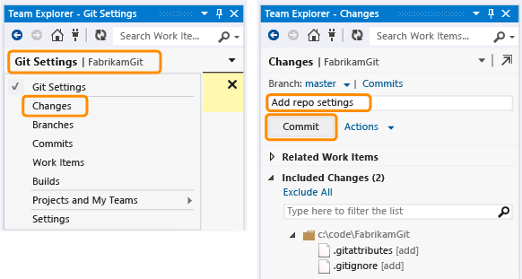

# ISC567Fall2014
==============

To contain collaborative work on the project for ISC 567, Fall 2014

## Visual Studio Setup

### Visual Studio 2013

If you have Visual Studio 2013, git integration is included. Follow the instructions under the [MSDN article regarding starting from a remote repository](http://msdn.microsoft.com/en-us/library/hh850445.aspx#remote). You will be most interested in the section regarding [cloning from a third-party repository](http://msdn.microsoft.com/en-us/library/hh850445.aspx#remote_3rd_party_connect_clone).

When prompted for the URL to the third-party service, use https://github.com/eas604/ISC567Fall2014.git .

### Visual Studio 2012

For Visual Studio 2012, you must install [Visual Studio Tools for Git](http://visualstudiogallery.msdn.microsoft.com/abafc7d6-dcaa-40f4-8a5e-d6724bdb980c).

Once that extension is installed, you should be able to follow the same instructions for Visual Studio 2013.

## Making Local Commits

Anytime you have changed files in the solution, have tested the changes, and are satisfied everything is working, you should make it a habit to `commit` your changes to your local git repository.

When committing to source control, always provide a helpful message briefly stating what you changed.

## Intended Workflow

The class is divided into five teams, each with a technical lead. Each technical lead should create a GitHub account and message me via Sakai's email system so I can add him or her as a contributor. Each team's technical lead will be responsible for getting the code from the team members, then merging it into this GitHub repository.

It is up to each team whether to have each team member use git locally before having the technical leads pull and merge the changes from all the team members. It is recommended as a best practice; however, it may not be easy for people unfamiliar with source control to learn the workflows quickly enough.
